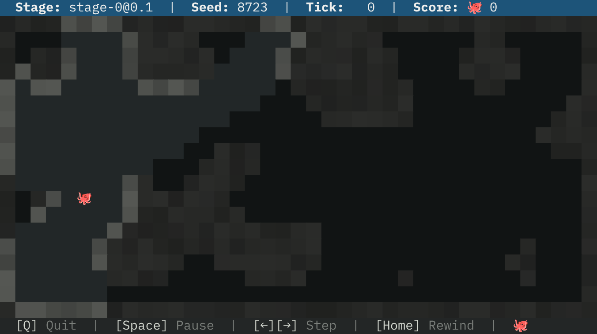

# Willkommen im Hidden-Gems-Blog

Willkommen zu unserem Blog für den »Hidden Gems«-Wettbewerb!
Hier veröffentlichen Teilnehmerinnen und Teilnehmer ihre Beiträge: spannende Analysen, Strategieskizzen, Erklärungen zu Algorithmen oder Erfahrungsberichte aus dem Wettbewerb.

Wenn du selbst mitmachen möchtest, erfährst du in diesem ersten Beitrag, wie du eigene Artikel einreichen kannst.

## Repository forken und klonen

Öffne das »Hidden Gems«-Blog-Repository unter [https://github.com/specht/hidden-gems-blog](https://github.com/specht/hidden-gems-blog) und lege einen Fork an. Klone deinen Fork anschließend auf deinen lokalen Rechner.

## Neuen Artikel erstellen

Erstelle in deinem lokalen Repository im Unterverzeichnis `content`ein neues Verzeichnis mit dem Namen deines Artikels im Format `YYYY-MM-DD-titel-deines-artikels`. Erstelle darin eine Datei namens `index.md`.

## Artikel schreiben

Schreibe deinen Artikel in der `index.md`-Datei. Du kannst Markdown verwenden, um deinen Text zu formatieren, Bilder einzufügen und Links hinzuzufügen.

<div class="alert alert-info">
    Um den Code zu sehen, der diesem Artikel zugrunde liegt, schau dir die <a href='https://raw.githubusercontent.com/specht/hidden-gems-blog/refs/heads/main/content/2026-01-18-hello-blog/index.md' target="_blank">index.md</a>-Datei
    dieses Artikels im GitHub-Repository an.
</div>

### Front Matter

Gib oben in der `index.md`-Datei die Metadaten deines Artikels im YAML-Format an. Hier ist ein Beispiel:

```yaml
---
author: Michael Specht
author_bio: >
  Informatiklehrer am Gymnasium Steglitz und
  Organisator des »Hidden Gems«-Wettbewerbs.
author_image: specht.jpg
tags: ["Anleitung", "Blog"]
---
```

Das Datum wird automatisch aus dem Verzeichnisnamen übernommen.

### Markdown

- **Überschriften**: Verwende `#` für Hauptüberschriften, `##` für Unterüberschriften usw.
- **Fett und Kursiv**: Verwende `**Text**` für fett und `*Text*` für kursiv.
- **Listen**: Verwende `-` oder `*` für ungeordnete Listen und `1.`, `2.` für geordnete Listen.
- **Bilder**: Füge Bilder mit `` ein (achte darauf, dass sich die Bilder im gleichen Verzeichnis wie deine `index.md`-Datei befinden oder verwende relative Pfade).
- **Links**: Füge Links mit `[Link-Text](URL)` ein.

### Bilder

Du kannst Bilder in deinem Artikel einfügen:



### HTML

Du kannst auch HTML-Tags verwenden, um deinen Artikel weiter zu gestalten, z. B. mit Tabellen:

<div style='max-width: 100%; overflow-x: auto;'>
<table class='table table-sm'>
<tr><th>Sprache</th><th>Eigenschaften</th></tr>
<tr><td>C++</td><td>Hohe Leistung, direkte Speicherverwaltung, umfangreiche Bibliotheken</td></tr>
<tr><td>Python</td><td>Einfach zu lernen, große Community, viele Bibliotheken für KI und Datenanalyse</td></tr>
<tr><td>JavaScript</td><td>Weit verbreitet im Web, viele Frameworks, gute Integration mit Web-Technologien</td></tr>
</table>
</div>

### Code

Du kannst Codeblöcke mit dreifachen Backticks (```) erstellen. Zum Beispiel:

```python
def hallo_welt():
    print("Hallo, Welt!")
```

Du kannst auch Code aus externen Dateien einbinden, indem du den Pfad zur Datei angibst:

```include
hello.cpp
```

### LaTeX-Code

Für mathematische Formeln kannst du LaTeX verwenden. Inline-Formeln kannst du mit `$...$` einfügen (diese erscheinen dann direkt im Fließtext: $E=mc^2$), und für abgesetzte Formeln verwende `$$...$$`. Zum Beispiel:

$$
d = \sqrt{(x_2 - x_1)^2 + (y_2 - y_1)^2}
$$

### Alerts

Du kannst verschiedene Arten von Alerts verwenden, um wichtige Informationen hervorzuheben:

<div class="alert alert-success">
    Success
</div>
<div class="alert alert-info">
    Info
</div>
<div class="alert alert-warning">
    Warning
</div>
<div class="alert alert-danger">
    Danger
</div>

### Icons

Falls du Icons brauchst, kannst du [Bootstrap Icons](https://icons.getbootstrap.com/) verwenden:

<div style='font-size: 200%'>
<i class="bi bi-gem"></i> <i class="bi bi-robot"></i> <i class="bi bi-cpu"></i> <i class="bi bi-balloon-fill"></i>
</div>

## Änderungen committen und pushen

Nachdem du deinen Artikel geschrieben hast, füge die neuen Dateien zu deinem Git-Repository hinzu, committe deine Änderungen und pushe sie zu deinem Fork auf GitHub:

```bash
git add .
git commit -m "Neuer Artikel: Titel deines Artikels"
git push origin main
```

## Pull Request erstellen

Gehe zu deinem Fork auf GitHub und erstelle einen Pull Request, um deine Änderungen zum Haupt-Repository beizutragen. Beschreibe kurz, worum es in deinem Artikel geht. Wir werden deinen Beitrag überprüfen und ihn dann in den Blog aufnehmen.

## Previews

Um ein Preview deines Artikels zu sehen, kannst du einfach den lokalen Preview-Server starten:

```bash
gem install rouge webrick kramdown # nur beim ersten Mal nötig
ruby server.rb [pfad-zu-deinem-artikel]
```

Du kannst dann deinen Artikel im Browser unter `http://localhost:4000` ansehen.