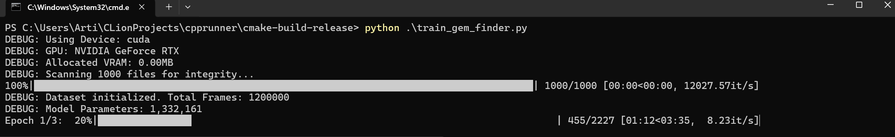
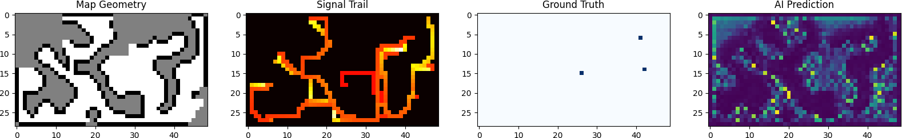
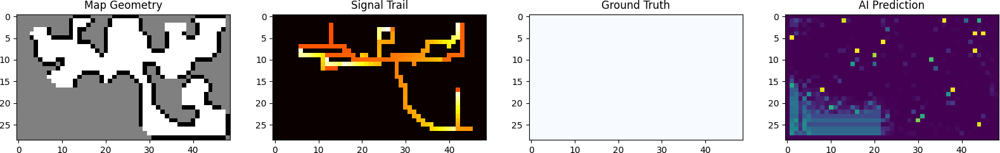
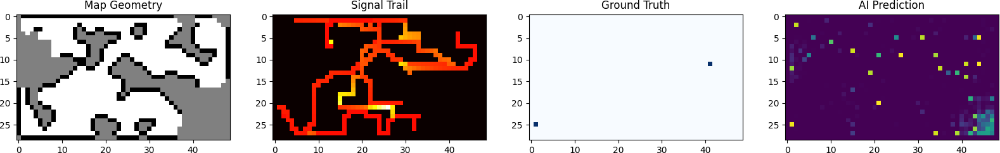
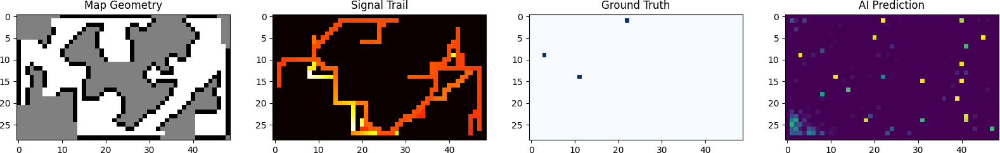
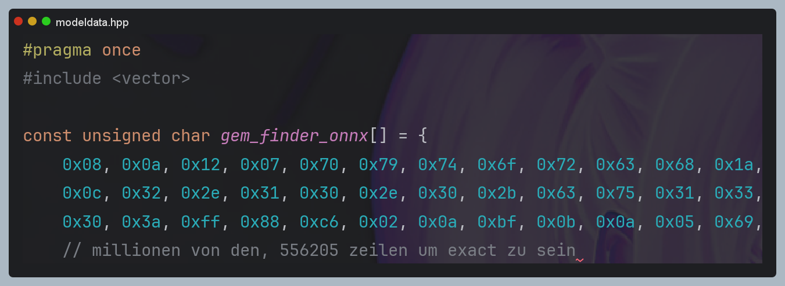
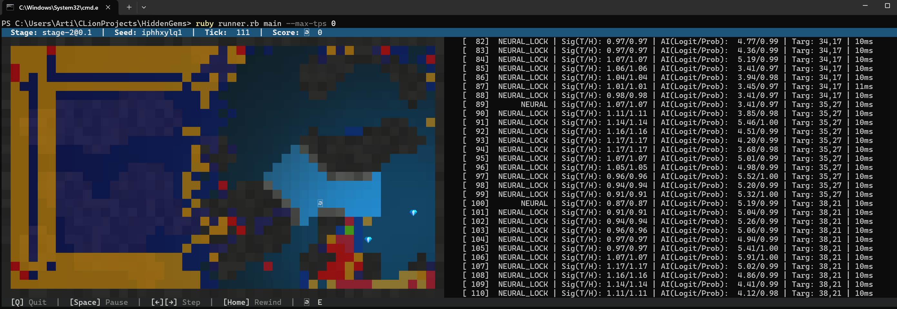

# Wie man bei einer KI für HG scheitert

Seit Stage 1 habe ich versucht, das durchzusetzen, aber wie ihr schon an der Überschrift erkannt habt, gelang es mir nicht so ganz haha

Da ich ziemlich faul bin, wollte ich nicht viel Zeit in Optimierung investieren. Dazu habe ich mir aus Langeweile ein paar Videos über Machine Learning angesehen, was mich dazu brachte, die Dinge etwas zu automatisieren

Edit: Wie ich sehe, sind manche auf dem Discord Server auch auf die Idee gekommen. Vielleicht wird das jemandem helfen, nicht die gleichen Fehler wie ich zu machen :D

## Precheck

Erstmal musste ich sichergehen, dass es überhaupt möglich war, das Ganze auf dem Server laufen zu lassen;
Naja, ich hatte immer die Vorstellung, dass KIs ziemlich groß sind und viel Compute benötigen. Nach ein paar Youtube-Videos dachte ich mir, ich exportiere das Ganze einfach in ein Header-File und lasse es ohne große ML-Libraries wie Torch laufen. Laut Google wäre ONNX Runtime eine gute Wahl, da es effizient und klein ist

Als erste Idee wollte ich die KI als "Anführer" nutzen, der das Tile ausgibt, wohin es sich zu gehen lohnt; das Pathfinding macht dann das Restliche

## Runner
Das erste Problem war der Runner. Ich bin eigentlich immer auf Windows unterwegs und Ruby ist hier katasrophal langsam. Interessanterweise ist Ruby sogar auf Linux-VMs schneller als nativ auf Windows...
Deswegen habe ich mir einfach mal ganz naiv vorgenommen, den Runner in C++ umzuschreiben. Mit etwas VibeCoding habe ich es geschafft, in den Bereich von etwa +-10 % der Scores zu gelangen. An sich war das ja schon mal ein Win, jedoch müssten sie absolut identisch sein, damit eine KI das perfekte Ergebnis erzielen kann

Es gab ziemlich viele Unterschiede, allein die Sprachunterschiede hatten große Auswirkungen. Nach etwas Surfen habe ich herausgefunden, dass der Floating Point Determinism ein großer Faktor war. In C++ ist `0.1 + 0.2` minimal anders als in Ruby, wenn man nicht extrem aufpasst (z. B. mit `/fp:precise`). Die Chaos-Theorie hat dann ihr Übriges getan und für ordentlich Abweichungen gesorgt. Auch der PCG32 war problematisch, da die Sequenz interessanterweise auch einen Einfluss hatte

Nach langem Kämpfen war Stage 1 fast zu Ende, jedoch habe ich es geschafft, **15.000 Ticks pro Sekunde** zu simulieren (heh, auf 32 Threads; eine Runde läuft auf einem Thread etwa 2s 500ms für 1200 Ticks. Die Skalierung ist nicht perfekt linear, aber 15k im Schnitt waren möglich)

```shell
PS C:\Users\Arti\CLionProjects\cpprunner\cmake-build-release> Measure-Command { .\cpprunner.exe "C:\Users\Arti\CLionProjects\HiddenGems\mainOld\cmake-build-release\bot.exe" --datagen -r 1 }
Days              : 0
Hours             : 0
Minutes           : 0
Seconds           : 2
Milliseconds      : 522
Ticks             : 25225242
TotalDays         : 2.91958819444444E-05
TotalHours        : 0.000700701166666667
TotalMinutes      : 0.04204207
TotalSeconds      : 2.5225242
TotalMilliseconds : 2522.5242
```

###### Nun kam bei mir die KlassenarbeitenPhase und ich musste das Projekt auf Hold legen... Zusätzlich waren die Finals nicht weit weg. Hab da zwar nicht so gut abgeschnitten, jedoch besser als in Stage 0, wo ich in den Scrims gecrasht bin

Zu spät war es für Stage 1, deswegen musste ich noch die Taktiken für Stage 2 implementieren. Dazu kamen auch die 2**48 Seeds (danke Seedcrackers für mehr Arbeit :D). Anscheinend wurde das Hashing von SHA256 zu PBKDF2-HMAC-SHA256 geändert, was auch etwas gedauert hat...

Ich habe mich für Supervised Learning entschieden (siehe weiter unten warum).
Mit der Zeit bin ich auf die wunderbare Idee gekommen, den Runner mit meinem Bot "zusammenschmelzen" zu lassen, um das ganze `cout` und die Pipes zu sparen. Die Simulierungszeit ist dann auf etwa 2 Sekunden gefallen; mit dem Nachteil, dass ich noch zwei Tage damit verbracht habe

Das Leichteste war einfach alles vorzusimulieren, was ich auch getan habe: 1000 Rounds je 1200 Ticks sollten meiner Meinung nach genug Trainingsdaten sein

## Das Training

In ML bin ich das erste Mal unterwegs und musste ziemlich viele neue Infos konsumieren, um das zu verstehen. Aus dem Schritt davor habe ich Daten im Format:

Eingabe (X): [Kanäle, Höhe, Breite]
- Kanal 0: Geometrie: Wand = -1, Unbekannt = 0, Boden = 1
- Kanal 1: Besucht?: 1,0 wenn ja, ansonsten 0.0
- Kanal 2: Signalspur: Der Signalwert, der aufgezeichnet wurde, als sich der Bot auf dieser Tile befand; Init mit -1 oder 0. Dies ermöglicht es dem Netzwerk, den Gradienten zu sehen (oder zu "spüren"). Die KI lernt also, ob das Signal stärker wird, während man läuft theoretisch Triangulation durch Bewegung
- Kanal 3: Aktuelle Position: One-Hot, der anzeigt, wo sich der Bot gerade befindet. Interessanterweise ist das laut einem Youtube-Video "schwieriger" für die KI, jedoch exakter. Gemeint war wohl, dass die KI so die Position direkt im Verhältnis zu den Wänden sieht, anstatt nur zwei Zahlen (X,Y) zu bekommen

Ziel (Y): [1, Höhe, Breite]
- Heatmap der tatsächlichen Gems

Da wir Simulationen von meinem Bot nutzen, der das Ziel nicht wirklich kennt, habe ich gehofft, die KI würde Muster erkennen. Zum Beispiel, dass wenn der Bot zum Signal geht, die Signalstärke größer wird und er somit schneller zum Gem gelangt... Das ist ja eigentlich Supervised Learning

Im Gegenteil: Wenn ich Reinforcement Learning genutzt hätte, würde die KI wahrscheinlich nur durch trial and error lernen welches noch länger dauert...

Eigentlich war das, was ich am Anfang vergessen habe (und wahrscheinlich immer noch der Grund, warum ich scheiterte), die "Motivation" für die KI, wirklich Gems zu finden, anstatt irgendwie den sicheren Weg zu nehmen und stehenzubleiben (was sie auch gemacht hat). Denn wenn man nicht bestraft wird, warum nicht? Man geht ja nicht ins Minus...

Zu einem späten Zeitpunkt bin ich darauf gekommen, wie die KI zu denken (ahahahah), und habe wenigstens etwas Bewegung hineinbekommen

Die KI wurde bestraft mit einem Gewicht von 200 für jeden reellen Gem, den sie nicht gefunden hat (und mit 1, wenn sie etwas falsch vorhergesagt hat). Also war es 200mal besser, zu versuchen Gems zu finden, anstatt sie ganz wegzulassen
<sub>("BCEWithLogitsLoss")</sub>

Mit einer KI-LLM als Ausführer und mir als Strategen sind wir bei PyTorch + Cuda stehen geblieben (danke Nvidia für die optimierungen). Mit 3 Epochen (also 3mal mit dem gleichen Dataset trainieren, damit sich die Patterns "einprägen") konnten wir beobachten, wie die KI von Zufallsbewegungen dazu überging, die Verbindung zwischen Gem und Signal zu lernen und gezielt zu den Gems zu gehen...



---

Laut den Bildern, die das Python Script exportierte (danke an eine LLM für die Idee), lief die Prediction akzeptabel genug...

Hier ein paar aus jeder Epoche:

Epoche 1:



Epoche 2:



Epoche 3:



Legende:
1. Map Geometry: Irgendwie selbsterklärend
2. Signalspur
  * **Was es ist:** Dies ist der wichtigste Hinweis für die KI. Es zeigt den Verlauf der Sensormessungen des Bots
  * **Die Farben:** Hellere Farben (Gelb/Weiß) zeigen eine höhere Signalstärke an, die auf diesen Tiles gemessen wurde, als der Bot dort stand
3. Ground Truth (Das Label / Zielwert)
  * **Was es ist:** Das sind die Gems, dort wo der Runner sie gespawnt hat
4. KI-Vorhersage (Der Heatmap-Output)
  * **Was es ist:** Das ist die Vermutung der KI. Hellere (gelbe) Pixel sind Bereiche, in denen die KI zuversichtlich ist, dass ein Gem existiert

---
Man kann eigentlich ganz gut sehen, dass die KI immer sicherer in ihren Vorhersagen wird. Ja, es ist nicht perfekt, aber wenn man das erste und das letzte Bild vergleicht, sieht man bei der Prediction ganz gut, dass einige Vorhersagen stimmen

Epoche 1, Bild 2 ist ganz lustig: keine Gems auf der Map, die KI sagt aber trotzdem etwas vorher; wahrscheinlich aus Patrol Gründen

## Inferenz (Integration)

Nun haben wir die "Gewichte" der Funktion. Ich stelle mir das einfach als Black Box vor; Daten gehen rein, Lösung geht raus


Das Ganze sind, so weit ich verstanden habe, "Logits", also die Raw-Werte, die die KI ausgibt. Die müssen wir dann in "Sigmoid" umwandeln, um die Wahrscheinlichkeit zu bekommen.
Dies ergibt ein 49x29 Grid mit Werten zwischen **0.0 (unmöglich)** und **1.0 (sicher)**

Die Entscheidung: ArgMax und Lock:
Nun muss der Bot diese Heatmap in einen Spielzug umwandeln
1. Der Bot scannt die Heatmap nach dem höchsten Wert (ArgMax)
2. Liegt dieser Wert über einem Schwellenwert (z. B. 0.20), bricht der Bot ab und wechselt in den Modus `NEURAL_LOCK`
3. Er prüft mithilfe seiner Internal Map, ob das Ziel erreichbar ist. Zeigt die KI auf eine Wand oder eine unerreichbare Insel, wird dieser Punkt auf eine Blacklist gesetzt

#### A*
Sobald die KI zu 99 % sicher ist, dass sich bei (47, 20) ein Gem befindet, übernimmt die Pfadfindung

---
Wenn wir das Ganze ausführen:



Die Steuerungslogik unterscheidet zwischen NEURAL (Zielerfassung) und NEURAL_LOCK (PfadPersistenz). Dies verhindert Oszillationen, bei denen geringfügiges Signalrauschen dazu führen könnte, dass der Bot zwischen zwei Tiles mit hoher Wahrscheinlichkeit hin- und herstottert. Wie in den Logs zu sehen ist, "verfeinert" der Bot sein neuronales Ziel während der Bewegung etwa alle 10 bis 15 Ticks. Dadurch wird der Suchradius von einem allgemeinen Bereich auf eine spezifische Tile eingegrenzt, noch bevor die Gems im Fog überhaupt sichtbar sind. (10ms Response Time ist auch ziemlich gut)

Der Bot erhält zum Beispiel in der heutigen Profile-Round (26.01.2026) nur wenig:
```shell
PS C:\Users\Arti\CLionProjects\HiddenGems> ruby runner.rb main --max-tps 0 --seed 26pwn1er10 --profile
Finished round 20 of 20...
Ran on seed 26pwn1er10 with 20 rounds.
Results for 🃏 Arti
Total Score     : 69273
Gem Utilization :  48.3 %
Chaos Factor    :  21.7 %
Floor Coverage  :  98.9 %
```
## Conclusion:

**Zeitverschwendung.** Gute alte Algorithmen sind immer noch besser und schneller zu bauen

Naja, ich gebe auf. Es hat so oder so schon ziemlich lange gedauert. Das, was ich wollte, habe ich ausprobiert. Vielleicht wird jemandem auffallen, wenn ich einen falschen Weg gegangen bin.
Eigentlich ist die KI gut in der **Wahrnehmung** (sie "fühlt" die Gems gut), aber sie scheitert an der **Strategie**. A* hat kein "Rauschen" und Heuristiken wissen genau, wann ein Gem abläuft (TTL). Die KI läuft manchmal los, obwohl das Gem schon fast weg ist

Wenn ich Zeit habe, werde ich vielleicht noch einen Versuch wagen, aber bis jetzt habe ich den Eindruck, dass es sich nicht lohnt

###### Das einzige gute ist das ich einen schnellen runner habe :D