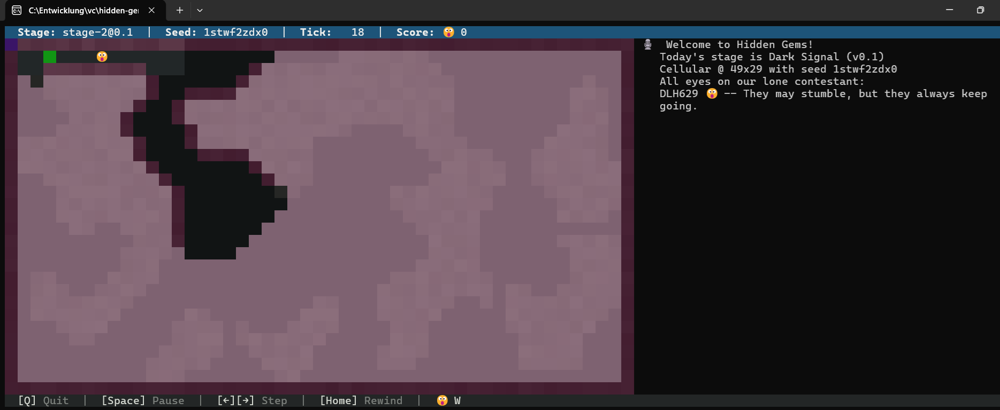
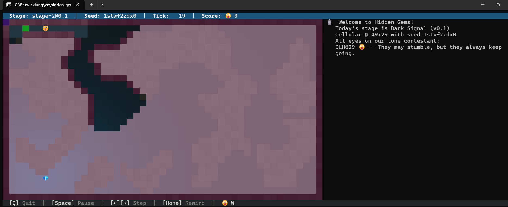
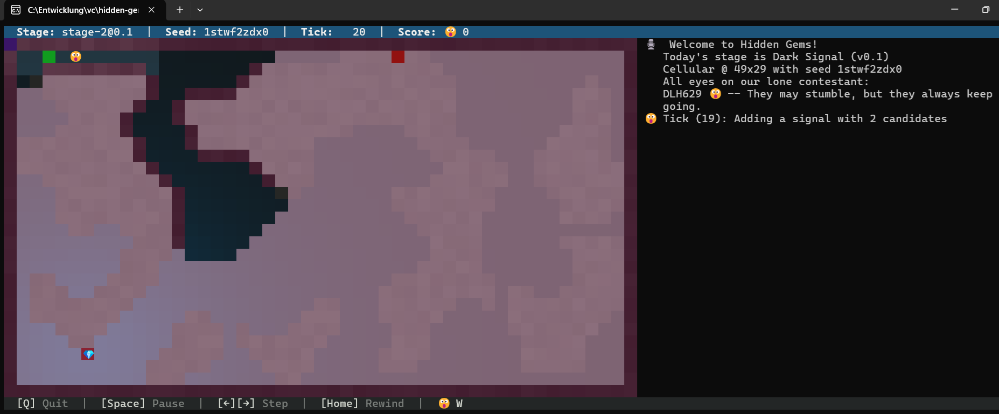
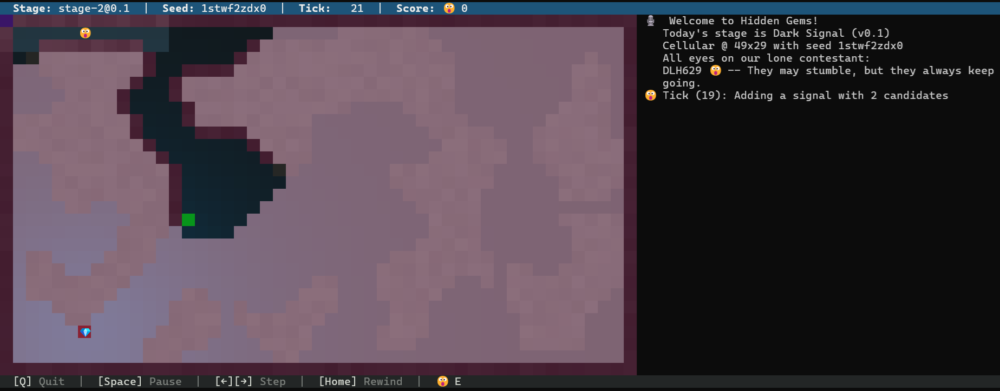
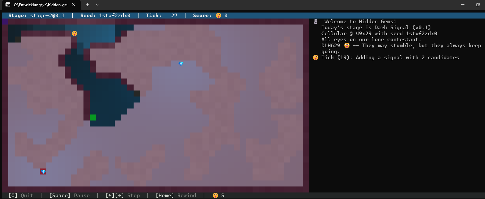
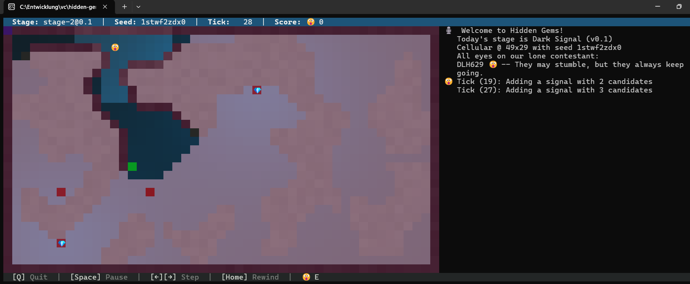
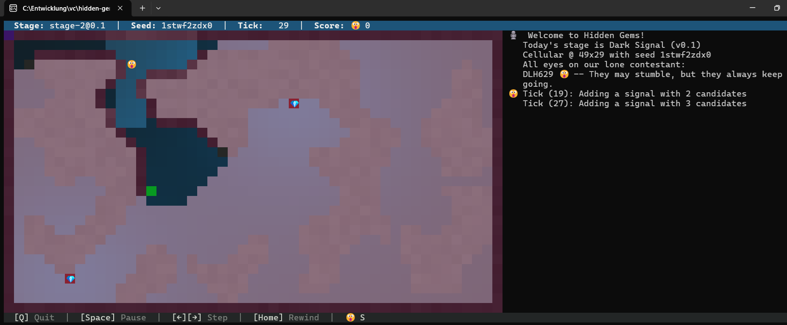

# Filtern, filtern, filtern ... nur wie?

<div class="alert alert-info">
$Disclaimer:$ Im Folgenden möchte ich meine aktuellen Gedanken zum Thema $Lokalisierung$ beitragen. Ich kann hier leider keine geschlossene, mathematisch-analytische Darstellung anbieten, es ist eher rein geometrisch bzw. $intuitiv$. Mit etwas Numerik komme ich damit aber schon $relativ$ weit. Ich verzichte daher in meinem Beitrag weitestgehend auf Formeln, und versuche meine Gedanken stattdessen mit etwas Text und Bildern darzulegen.
</div>

## Das Ziel

Ich möchte natürlich die Gems finden. Punkt. Nun sehe ich sie aber leider nicht immer sofort, weil sie entweder hinter einer Wand sind (vgl. Stage-1), oder meine Sichtweite zu kurz ist (Stage-2). Dafür empfange ich nun ein Signal von jedem Gem, klingt erst einmal prima. Leider empfange ich aber nur das Summen-Signal aller Gems. Mein Ziel ist es nun, in möglichst wenigen Ticks aus dem Summen-Signal (mehr oder weniger) exakt auf die Gems zu schließen.

## Grundannahmen

Meine wesentlichen Annahmen sind:

1. In einem Tick kommt höchstens ein neues Signal (m.a.W. Gem) hinzu
   **Ausnahmen**:
    - Diese Eigenschaft ändert sich noch einmal im runner bei *max_gems > 1*
    - Der "Gegner"-Bot trifft (quasi) gleichzeitig mit mir einen unterschiedlichen Gem (*max_gems >= 2*)
<br>
2. In einem Tick fällt höchstens ein Signal weg
   **Ausnahmen**:
    - Der "Gegner"-Bot trifft (quasi) gleichzeitig mit mir einen Gem (*max_gems >= 2*) und mein Ziel hat einen TTL=0

Mutmasslich habe ich jetzt weitere Ausnahmen noch übersehen... 

Im Weiteren betrachte ich nur die Signale und ignoriere den Gegner.

## Situation 1: Ich sehe gar nichts

Das ist die typische Ausgangssituation. Mein Bot kennt die Welt noch nicht, empfängt noch kein Signal und läuft erst einmal los.
Hier am Beispiel des Seed: 1stwf2zdx0.

Hinweise: 

1. Euer Bot läuft bestimmt anders, insofern ist das sicher nicht mit jedem Tick vergleichbar
2. Die Einfärbung der Area in den Bildern ist:
    - <span style="color:#63193e">**violett**: Die mir bekannten Wände</span>
    - <span style="color:#e8aecb">**rosa**:    Das Unbekannte</span>
    - <span style="color:#00ff00">**grün**:    Mein aktuelles Ziel</span>
    - <span style="color:#ff0000">**rot**:     Mögliche Orte der Gems</span>
3. Wie wir wissen, sehen wir unsere Debug-Ausgaben (prinzipbedingt) immer erst einen Tick später, als wir sie tatsächlich wahrgenommen und ausgegeben hatten. 
   Dies gilt es bei der Betrachtung der Bilder zu berücksichtigen und insofern beziehen sich die von mir im Text genannten Ticks auch immer auf das jeweilige Bild.
   Tatsächlich hat mein Bot stets einen Tick vorher die Situation erkannt und sich auch gemerkt.

Also dann mal los! Hier die Situation bei Tick 18. Seht Ihr was? Mein Bot sieht nur ein paar Wände und Böden, sonst nichts...


<br>
## Situation 2: Ich empfange ein Signal

Wow! In Tick 19 taucht ein Signal auf! Das sieht dann so aus:



Aber was mach ich jetzt nur damit? Okay, der naheliegende Gedanke ist ja, sich alle möglichen Positionen des Signals auszurechnen.
Ich schlage also vermöge der Umkehrfunktion:

$distance = signalradius * \sqrt{1.0 / signallevel - 1.0}$

einen Kreis um mich und finde ein paar Kandidaten, die ich auch in Tick 20 sehen kann:


Sieht schon einmal gar nicht so schlecht aus, oder? Immerhin ist der Gem schon einmal im "*Empfangskreis*" und der Code für diesen Kreis ist trivial:

```cpp
    // calculate a new circle
    static const double pi2 = 2 * std::numbers::pi;
    static const double pi144 = std::numbers::pi / 144.0;
    Circle circle;

    for (double phi = 0.0; phi < pi2; phi += pi144)
    {
        double   x = (double)mBotPerception.mPosition.mX + mBotPerception.mDistance * sin(phi);
        double   y = (double)mBotPerception.mPosition.mY + mBotPerception.mDistance * cos(phi);
        int16_t  px = (int16_t)std::llround(x);
        int16_t  py = (int16_t)std::llround(y);
        
        if (px > 0 && px < mMaxX && py > 0 && py < mMaxY)
        {
            Position pos(px, py);

            if (mBot.GetTileState(pos) != OCCUPIED)
            {
                circle.mCircumference.insert(pos);
            }            
        }
    }
```

Aber möchte ich so eine Situation wirklich? Mit 49 <span style="color:#ff0000">**Kandidaten**</span> im <span style="color:#e8aecb">**Unbekannten**</span>? **Nein!**

## Situation 3: Ich will die Signale präzise und zwar *jetzt*!

Das Ziel muss ja sein, möglichst schnell (im Sinne von Ticks) das Signal bzw. die Signale eindeutig zu identifizieren, denn nur dann kann ich die identifizierten Signale sicher von der Signal-Summe abziehen.

Also noch einmal von vorne, diesmal mit Filterung. Bemerkt bitte, dass es derselbe Tick 20 ist. Nun habe ich anstatt 49 nur noch 2 Kandidaten und der Gem ist immer noch im Visier:



Was macht mein Filter da eigentlich? Nichts Besonderes! Er rechnet nur von allen Kandidaten rückwärts, diesmal aber mit der Formel:

$signallevel = 1.0 / (1.0 + (distance / signalradius)^2)$

Das eigentliche Problem ist ja die *Diskretisierung* der möglichen Tiles vermöge der *Rundung* der exakten Positionen am Anfang der Kreis-Bildung, da geht zunächst sehr viel Information "verloren" und dadurch ensteht ja der große Kreis erst überhaupt! Man könnte nun annehmen, dass bei der Rückwärtsrechnung alle Tiles des Kreisumfanges auch meinen Bot wieder treffen, dem ist aber nicht so, denn ich runde ja wieder. Diesmal aber nicht die Distanzen, sondern die Signal-Level:

```cpp
    // now do the opposite since I've rounded
    SignalPositionSet tmp;
    auto              it = circle.mCircumference.begin();
    int64_t           botlevel = std::llround(mBotPerception.mLevel * 1000000.0);
    int64_t           circleposlevel;

    for (;it != circle.mCircumference.end(); ++it)
    {
        SignalPosition pos(it->mPosition);
        pos.mDistance = it->mPosition.EuclideanDistance(mBotPerception.mPosition);
        pos.mLevel = 1.0 / (pow(pos.mDistance / mSignalRadius, 2) + 1.0);
        circleposlevel = std::llround(pos.mLevel * 1000000.0);

        // select a margin
        if (std::abs(circleposlevel - botlevel) < 2)
        {                
            tmp.insert(pos);
        }
    }

    circle.mCircumference = tmp;
```

Wie man am Code erkennt, ist auch noch eine gewisse Marge darin, der Filterparameter sozusagen. Jeder <span style="color:#ff0000">**Kandidat**</span> auf dem Kreisbogen, der diese Bedingung nicht erfüllt, fliegt raus!

**Ein Wort zur Warnung**: Es kann natürlich vorkommen, dass alle Tiles des Kreisbogens ausgefiltert werden. Das wäre dann extrem blöde, muss ich also noch abfangen. Mutmasslich ist auch das der Grund, weshalb sich neulich in einem Sparring mein Bot mitten in der Runde sang und klanglos verabschiedet hatte...

## Situation 4: Wozu das ganze Filtern?

Das ist wirklich eine interessante Frage! Meine Idee ist, dass je weniger Signal-Kandidaten ich (pro Tick) habe, desto weniger muss ich prüfen. Mir ist schon klar, dass das auch *ohne* Filterung ab einem *gewissen* Tick funktionieren würde. Nur haben wir leider nicht besonders viele Ticks und am Ende ist auch noch einen Gegner dabei...

Nein im Ernst, mit diesem Filter habe ich bereits in Tick 21 den Gem genau im Unbekannten *eingekreist*, leider noch nicht getroffen:



## Situation 5: Und noch ein Gem...

Schaut mal auf meine Area in Tick 26. Ich kenne nur diesen ersten Gem, mein aktuelles <span style="color:#00ff00">**Ziel**</span> geht schon einmal in seine Richtung und ich *spüre* bereits eine Signal-Änderung...


... und Zack! Im Tick 27 sehe ich den neuen Gem auch in der Area:



... nächster Tick 28. Es gibt 3 neue (bereits gefilterte) <span style="color:#ff0000">**Kandidaten**</span>...



Tick 29: Nun habe ich exakt 2 <span style="color:#ff0000">**Kandidaten**</span> für 2 Signale:



## Fazit: Ist so ein Konzept überhaupt sinnvoll?

Meine ganz ehrliche Antwort ist: Ich weiß es nicht!

Den *Suchraum* möglichst schnell einzugrenzen halte ich allerdings schon für sinnvoll. Zumal erst dann m.E. eine Substraktion der bekannten Signale von dem Summen-Signal möglich ist.

Sollte dies gelingen, ist der Rest ja *nur* noch die richtige Pfadplanung...

Happy Coding!
Michael (a.k.a. Buffo)
