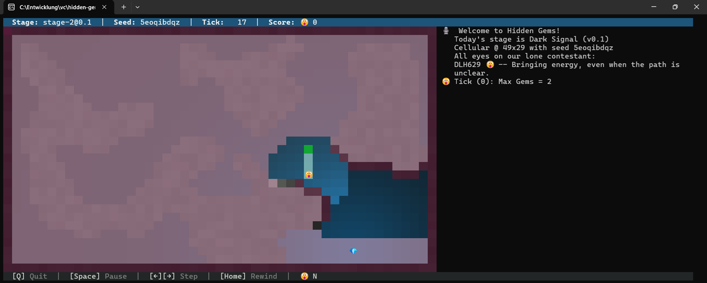
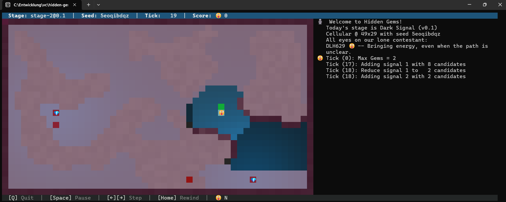
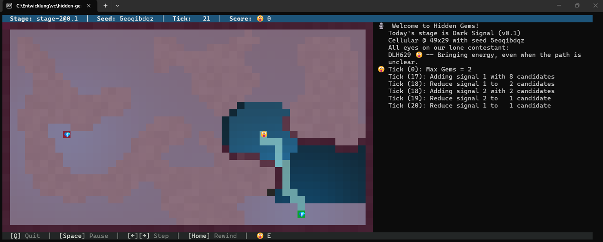

# Filtern in der Stage-2, was habe ich dazu gelernt?

## Vorwort

Um es gleich zu sagen: **Sehr viel!** Und dies vor allem durch die sehr wertvollen Beiträge hier in den Blogs sowie auf dem Discord Kanal!

Mein Bot hat in der Rangliste einen schönen Satz "nach oben" gemacht, was hat das aber mit dem Filtern zu tun?

Ich möchte in diesem Beitrag meine Erfahrungen aus meinen Ups & Downs weitergeben, die ich in der Stage-2 *durchlitten* hatte ;o)

## Einleitung

Meine, nein **unsere**, Zielsetzung hat sich natürlich nicht geändert. Gems finden, und zwar möglichst schnell!

Auch meine Grundannahmen haben sich nicht geändert. Sie sind in unserem gemeinsamen Austausch bestätigt worden.

Hinweise:
1. Euer Bot läuft bestimmt anders, insofern ist das sicher nicht mit jedem Tick vergleichbar
2. Um mein Beispiel *nachzuspielen*, müsst Ihr natürlich die Stage-2 Parameter nehmen!
3. Ich verwende für dieses Beispiel den Seed **5eoqibdqz**
4. Evtl. noch meinen ersten Beitrag lesen. Das soll jetzt aber **wirklich** keine Werbung sein!

## Situation 1: Ich *empfange* etwas...

Endlich! Ich empfange ein Signal in Tick 17! Soweit, so gut:


<br>

Und ja, in Tick 18 erkenne ich auch meinen *gefilterten* Kreis, in dem der Gem liegen muss:


<br>

Aber **Moment**! Ich habe noch immer 8 <span style="color:#ff0000">**Kandidaten**</span>!
Mein Filter wirkt schon, aber da links außen kommt bereits das nächste Signal. Spannend!

Was passiert nun? Mein Filter steigt in Tick 19 aus, denn er kann die 8 <span style="color:#ff0000">**Kandidaten**</span> 
nicht mehr filtern und hat das neue Signal noch nicht einmal im Visier. Oh weia:


<br>

Erkenntnis: **So** geht's nicht! Aber was nun? Filtern vergessen? Oder ganz anders filtern?

## Situation 2: Noch mal von vorne oder verfeinern?

Ich bin ja manchmal auch etwas beratungsresistent und stur. Also verfeinern! Los!!!

Und nun derselbe Tick 19 nach einer weiteren Optimierung:


<br>

Öha! Da scheint etwas zu wirken. Ich habe nun nicht nur die 8 <span style="color:#ff0000">**Kandidaten**</span> auf 2 eingedampft,
sondern auch das ziemliche ferne Signal mit 2 <span style="color:#ff0000">**Kandidaten**</span> im Visier ;o) Ich bleibe zuversichtlich...

Schaut mal, was da 2 Ticks später (Tick 21) passiert:


<br>

Ich habe nun 2 Signale mit *exakt* 2 <span style="color:#ff0000">**Kandidaten**</span>!

Wem es (noch) nicht aufgefallen ist: Vgl. meine Debug-Ausgaben... ;o)

Aber was habe ich denn nun an meinem Bot geändert?

An und für sich nichts Besonderes, es hatte dennoch eine Wirkung...

Ich habe jetzt nicht nur den Bot sowie die vermeintlichen Signale berücksichtigt,
sondern auch alle verbliebenen <span style="color:#ff0000">**Kandidaten**</span> ebenso!

D.h. ich berechne mit allen bekannten <span style="color:#ff0000">**Kandidaten**</span> rückwärts.
Mein (zugegeben) gewöhnungsbedürfter C++ Code sieht dann so aus:

```cpp
    if (0 == size && !map.empty())
    {
#if 1
        // think twice!
        for (auto mit = map.begin(); mit != map.end(); ++mit)
        {
            SignalPosition testpos;
            testpos.mLevel = std::fabs(mit->second.mLevel - remaininglevel);
            Update(mTick, pos, testpos.mLevel, testpos);
            
            SignalPositionSet circumference;
            CalculateCircle(testpos, circumference);

            if (!circumference.empty())
            {
                // keep this circumference tile!
                tmp.insert(mit->second);
            }
        }
#else
        for (auto mit = map.begin(); mit != map.end(); ++mit)
        {
            tmp.insert(mit->second);
        }
#endif
    }
```

## Meine Erkenntnisse

Ich habe vor allem folgende Erkenntnisse aus der Stage-2 mitgenommen:
1. Unser gegenseitiger Austausch ist das **Wichtigste**!
2. Jeder geteilte, eigene Misserfolg hilft und unterstützt die Mitbewerber
3. Filtern ist nicht die schlechteste Idee
4. Wir stehen zusammen in einem **ganz** starken Wettbewerb!!!

## Fazit: The show will go on!

Ich freue mich wirklich auf die Stage-3!

Keine Ahnung, inwiefern ich da abschneide, es ist und bleibt aber spannend!

Happy Coding!
Michael (a.k.a. Buffo)
