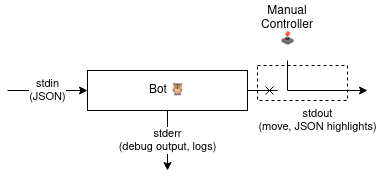
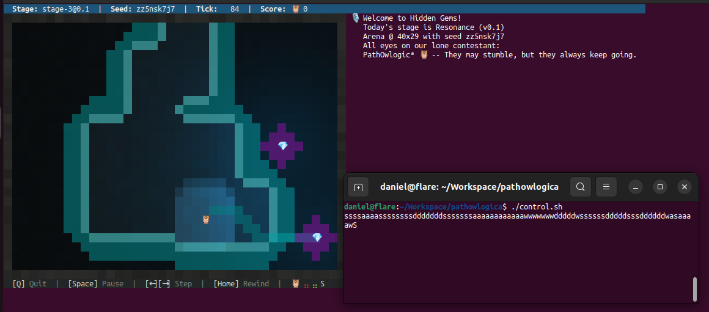

# Botsteuerung aus dem Terminal

In diesem Beitrag geht es nicht um eine bestimmte Spielstrategie oder um eine Methode, die Gems im Labyrinth zu lokalisieren, sondern um ein Werkzeug, das mir beim Entwickeln hilfreich war und nach wie vor ist.

Ich möchte euch zeigen, wie ich auf einfachste Weise einen Controller gebastelt habe, um meinen Bot mittels WASD Steuerung auf dem Terminal durch das Spielfeld zu navigieren.
Damit kann ich beispielsweise interaktiv experimentieren, wie Bewegung sich auf den Algorithmus zur Lokalisierung der Gems mittels der Signale auswirkt.
Die Methode greift nicht den Bot-Code an, sondern das Start-Skript, funktioniert also unabhängig von der Enwicklungssprache mit minimalem Aufwand.

<div class="alert alert-info">
    Die Methode setzt Linux voraus, und dass der Runner nicht in einem Container läuft.
</div>


## Botkommunikation

Wie ihr wisst, ist das Grundprinzip des Bots die Ausführung folgender Schleife:
1. Lesen der Umgebungsinformation (entspricht "Sensorwerten") von der Standardeingabe (`stdin`)
2. Verarbeitung der Information
3. Schreiben der Aktion (des "Control-Outputs") auf die Standardausgabe (`stdout`).
Debug-Ausgaben (oder Nachrichten vom Bot) können unabhängig davon auf die Standardfehlerausgabe (`stderr`) geschrieben werden.

Der Runner führt dabei den Bot als Kindprozess aus und schreibt die JSON-Zeile in dessen `stdin`, und liest die Aktion samt Highlights (und debug commands) von dessen `stdout`. Die Nachrichten von `stderr` liest der Runner genauso und schreibt sie in sein Nachrichtenfeld.

Die Idee ist nun folgende: Was wäre, wenn man die Aktion des Bots "von außen" überschreiben könnte, sich also wie mit einer manuellen Fernsteuerung zwischen die Ausgabe des Bots und den Runner hängt?
Debug-Ausgaben können weiterhin über den internen Zustand des Bots Aufschluss geben.
Idealerweise sollten die Highlights dabei unverändert bleiben.




Das setzt natürlich voraus, dass der Bot es toleriert, wenn seine neue Position nicht der erwarteten Position nach seiner geschriebenen Aktion entspricht.


## Linux and Bash I/O Redirection

Linux bietet Mechanismen, um dies einigermaßen leicht bewerkstelligen zu können, und die man auch in der Bash nutzen kann.

Die oben genannten Standardein- und ausgaben sind in Linux -- nach dem Motto “*everything is a file*” -- Dateien, die bereits zu Beginn der Prozessausführung geöffnet sind.
Jede offene Datei ist mit einem *file descriptor* assoziiert, so auch `stdin` (0), `stdout` (1) und `stderr` (2).
Offene Dateien können *umgeleitet* werden, was bedeutet, dass die Ausgabe beispielsweise einer Datei, eines Programms, oder eines Skripts als Eingabe für eine andere Datei, eines Programms oder Skripts benutzt werden kann.

Häufige Anwendungen sind zum Beispiel das Umleiten einer Programmausgabe in eine Datei, oder das Nutzen von sogenannten *Pipelines*, bei denen man Programme mittels `|` verkettet und die Ausgabe eines Programms direkt als Eingabe für das nächste Programm in der Pipeline nutzt.
(Das wird übrigens in [Hackschule - Working with Files](https://workspace.hackschule.de/working-with-files) kurz angesprochen.)

In der Bash kann man nun weitere Dateien öffnen und dazu die File-Deskriptoren 3-9 nutzen.
Zur Demonstration lesen wir als ersten Schritt die Aktionen (N, W, E, S, WAIT) aus einer Textdatei und überschreiben die Aktionen des Bots damit.

Das Start-Skript im Lua-Template sieht ursprünglich so aus:

```bash
#!/bin/sh
set -e
exec lua bot.lua "$@"
```

In der dritten Zeile wird das Prozessimage des Prozesses, der das Shellskript ausführt, durch den Lua Interpreter ausgetauscht.
Ab dem Zeitpunkt können wir nichts mehr machen, also werden wir die Umleitungen davor aufsetzen.

Machen wir erstmal Folgendes:
```include
start.0.sh
```

In Zeile 1 stellt sicher, dass die Bash als Interpreter verwendet wird.
Zeile 4 ist der Pfad zu der Datei, die die vordefinierten Aktionen enthält.
Zeilen 6-15 definieren eine Funktion, die wir uns gleich genauer ansehen.

Das erste Wichtige passiert in den Zeilen 17- 20.
Nur wenn die Datei existiert, wird `exec > >(inject_move)` ausgeführt.
Was macht der Befehl?  Der linke Teil, `exec >` bedeutet, dass ab da *dauerhaft* die Standardausgabe umgeleitet wird, und zwar in den rechten Teil.
**Diese Umleitung bleibt auch nach dem Ersetzen des Prozessimages bestehen!**

Der rechte Teil, `>(inject_move)` bewirkt, dass die Funktion `inject_move` im Hintergrund als eigenständiger Shell-Prozess gestartet wird, und einen File-Deskriptor liefert, der alles was auf ihn geschrieben wird, an die Standardeingabe von `inject_move` leitet.

Zusammengesetzt bedeutet das: Ab da wird jede Ausgabe des Skripts -- und in weiterer Folge des Bots -- nicht mehr auf `stdout` ausgegeben, sondern durch `inject_move`  gepiped.

Die Funktion `inject_moves` beginnt mit der Zeile 8, `exec 3< "$MOVES"`. Das öffnet die Datei `/tmp/moves.txt` lesend (`<`) und assoziiert sie mit dem File-Deskriptor 3.

Dann haben wir die Schleife
```bash
while read MOVE REST
do
    read -u 3 NEW_MOVE
    echo $NEW_MOVE $REST
done
```

Sie liest in jedem Schleifendurchlauf eine Zeile von der Standardeingabe und speichert den Inhalt in den Variablen `MOVE` und `REST`.
Die Standardeingabe der Funktion ist aber die Standardausgabe des Bots, aufgrund der oben beschriebenen Umleitung.
`$MOVE` enthält also die Aktion des Bots, `$REST` das was danach (durch Leerzeichen getrennt) kommt (das JSON mit den Highlights).
Im Schleifenrumpf wird eine Zeile von File-Deskriptor 3 gelesen, also der Datei mit den Aktionen, und der Variable `NEW_MOVE` zugewiesen (Zeile 12).
Dann (Zeile 13) wird eine Zeile ausgegeben, die aus `$NEW_MOVE` und `$REST` zusammengesetzt ist.
Die Ausgabe erfolgt auf die Standardausgabe. Die Funktion `inject_move` läuft in einem eigenen Prozess und ist von unserer Umleitung nicht betroffen.
Letzten Endes ist das die Zeile, die der Runner erhält.

Testen wir das mit einer Beispieldatei `/tmp/moves.txt`:
```include
moves.txt
```

Da die Umleitung und das Lesen vom File mehr Ausführungszeit benötigt, deaktivieren wir für den Runner die Timeouts mit `--timeout-scale=0`.
Das brauchen wor ohnehin später auch für unsere interaktive Steuerung.


```bash
./runner.rb --timeout-scale=0 -g arena --max-gems=2 --gem-ttl=50 \
    --signal-fade=10 --vis-radius=4 -s zz5nsk7j7 pathowlogica
```

<div class='f ansi-player-auto-pickup mb-3' data-url='moves-zz5nsk7j7.json.gz' data-autoplay='false'>
    <div class='ansi-player-screen'></div>
</div>
Man erkennt, dass der Bot nicht dem Pfad folgt sondern von etwas anderem "gezogen" scheint.
Nach den Inputs aus der Datei beendet sich der Bot.


## Der Controller

Okay, nun wollen wir das ganze interaktiv gestalten.
Dazu lesen wir die Aktionen nicht aus einer Textdatei, sondern bedienen uns einer *Named Pipe* (oder *FIFO*).
Diese verbindet zwei Prozesse im System miteinander, und zwar so, dass der eine Prozess liest und der andere schreibt.
Dabei blockieren die Prozessen beim Öffnen solange, bis auch jeweils das andere Ende geöffnet wurde.

Das aktualisierte Skript sieht wie folgt aus:
```include
start.sh
```
Neben dem einen Unterschied, dass die Variable nun `CMDFIFO` heißt und auf den Pfad `/tmp/cmd.fifo` zeigt, testet Zeile 17 die Existenz des Pfades und dass dort eine *Named Pipe* ist.
Wir überlassen das Anlegen der Pipe unserem Controller, sodass nur dann wenn der Controller läuft, auch die Umleitungen im Start-Skript aktiv sind.
Damit laufen wir keine Gefahr, dass die Pipe vom Start-Skript angelegt wird, und so den Bot für die Ausführung im Bewerb disqualifiziert.

Der Controller ist ebenfalls lediglich ein kleines, kompaktes Bash-Skript:
```include
control.sh
```

Zeile 3 zeigt auf den selben Pfad wie das Start-Skript.
Zeile 5 installiert einen *Trap-Handler*: der Befehl um die Pipe zu entfernen wird ausgeführt, sobald sich das Skript beendet.
Zeilen 7 und 8 legen die Named Pipe an und Öffnen sie zum Schreiben (`>`) auf File Deskriptor 4. Den habe ich einfach so gewählt, es hätte auch die 3 sein können, wie im Start-Skript.
Danach kommt die Schleife, die vom Terminal liest, nämlich genau ein Zeichen, welches nicht unmittelbar auf das Terminal ausgegeben wird (Zeile 10).
Je nach gelesenem Zeichen wird eine Aktion definiert, und zwar nach einer `WASD` Steuerung, wobei sowohl Groß-, als auch Kleinbuchstaben akzeptiert werden.
Ein Punkt `.` wird zu einem `WAIT`; alle anderen Zeichen werden ignoriert.
Mit `Ctrl+C` beendet man den Controller.
Die gültigen Zeichen werden auf die Standardausgabe geschrieben, wodurch es möglich ist, diese in eine Datei umzuleiten und von dieser bei einem erneuten Aufruf zu lesen (Replay!).
Die Aktion wird auf File-Deskriptor 4 (das geöffnete Schreibende der Pipe) geschreiben.

Gegebenenfalls das Skript als Executable markieren (`chmod a+x control.sh`).
Wenn wir das Control-Skript nun in einem anderen, eigenen Terminal zuerst starten, wird die Named Pipe angelegt.
Beim Aufruf vom Runner wird so im Start-Skript diese Pipe gesehen und lesend geöffnet - der "interaktive Modus" läuft.
Nun kann man im Terminal mit dem Control Skript mittels `WASD` seinen Bot interaktiv durch die Arena oder ein Maze steuern!
(Achtet darauf, den Fokus dabei auf das Terminal mit dem Controller zu haben, nicht auf das mit dem Runner.)




Ich hoffe, dem einen oder anderen hilft dieses Werkzeug so wie auch mir.


## Weiterführende Links

[Advanced Bash-Scripting Guide - Chapter 20. I/O Redirection](https://tldp.org/LDP/abs/html/io-redirection.html)
